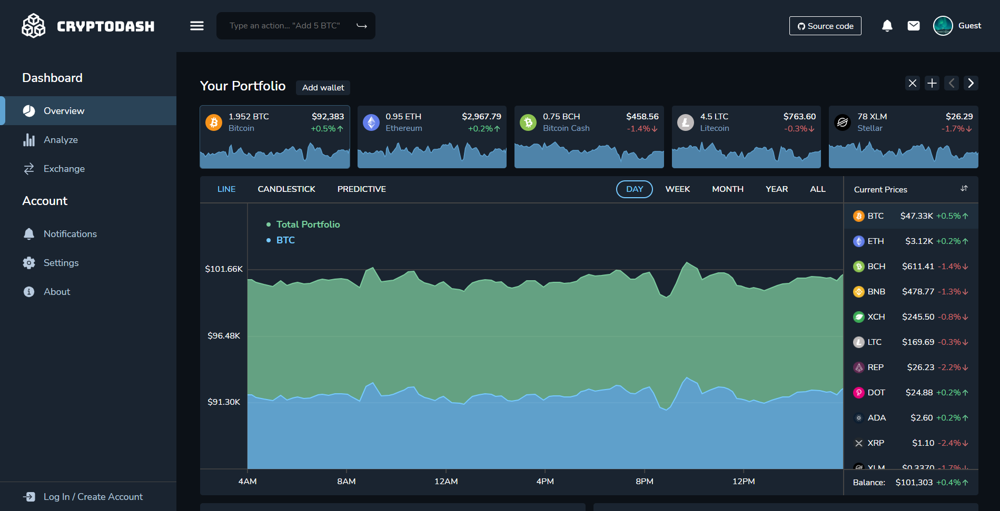

# cryptodash-client



Server: https://github.com/krogank9/cryptodash-server

## Prerequisites

- Node.js (v14 or higher recommended)
- npm

## Setup

1. **Clone the repository**
   ```bash
   git clone https://github.com/krogank9/cryptodash-client.git
   cd cryptodash-client
   ```

2. **Install dependencies**
   ```bash
   npm install
   ```

3. **Ensure the server is running**
   
   The client expects the [cryptodash-server](https://github.com/krogank9/cryptodash-server) to be running. By default, in development mode it connects to `http://localhost:8443/api`.

## Running the Application

### Development Mode

```bash
npm run dev
```

This starts the Next.js development server with hot-reloading at `http://localhost:3000`.

### Production Mode

1. **Build the application**
   ```bash
   npm run build
   ```

2. **Start the production server**
   ```bash
   npm start
   ```

## Configuration

The API endpoint is configured in `config.js`:
- **Development**: `http://localhost:8443/api`
- **Production**: `https://cryptodash.ltkdigital.com:8443/api`

To change these, edit the `config.js` file in the project root.
